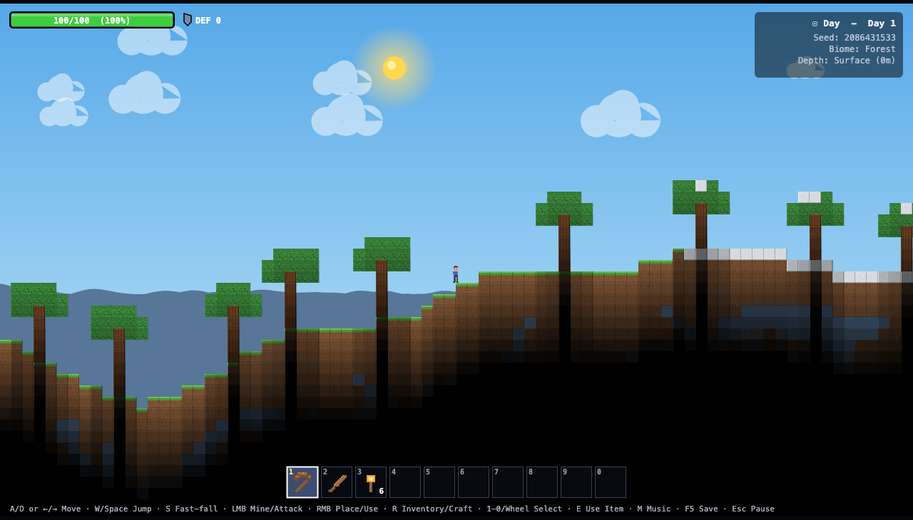
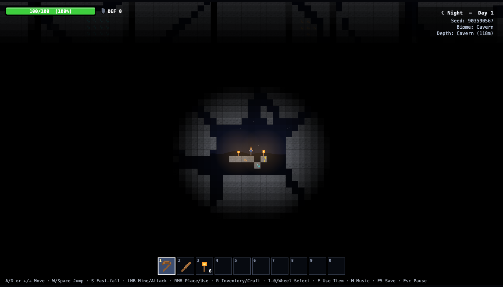
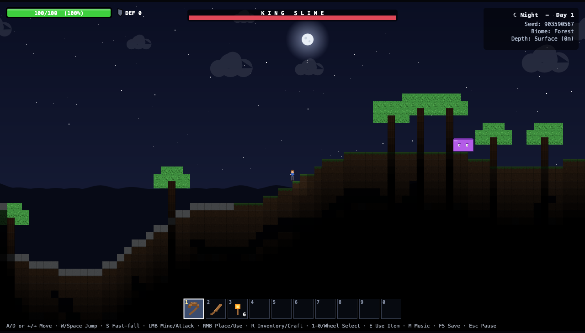
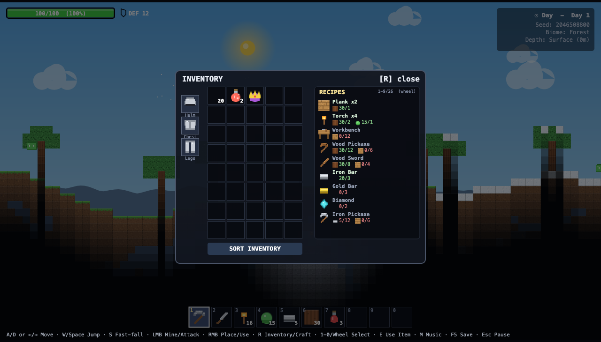

# TerraClone

A single-file 2D sandbox game inspired by Terraria. Everything — world generation, pixel art, lighting, and music — is procedurally created at runtime in one self-contained HTML file (~2,000 lines of plain JavaScript, no external libraries).

[](https://github.com/joonanykanen/terraclone/actions/workflows/deploy.yml)

## Play

- **Online:** [https://joonanykanen.github.io/terraclone/](https://joonanykanen.github.io/terraclone/)
- **Local:** Download [`index.html`](index.html) and open it in any modern browser.

<picture>
  <source media="(prefers-color-scheme: dark)" srcset="screenshots/hero_night.png">
  
</picture>

**Controls:** A/D or ←/→ move · W/Space jump · S fast-fall · LMB mine/attack · RMB place/use · R inventory & crafting · E use selected · 1-0/wheel hotbar · M music · F5 quick-save · Esc pause

## Features

- **Procedural world** (400×200 tiles, Perlin noise): 3 biomes (forest, desert, snow tundra), caves, depth-gated ores (iron / gold / diamond), bedrock, trees
- **Day/night cycle** with sun, moon, stars, clouds, 3-layer parallax mountains, snow/sand ambient particles
- **Tile lighting**: sky light blocked underground, torch radial glow, darkness overlay
- **Enemies**: slimes (day & night), zombies & bats (night), and the **King Slime** boss (Slime Crown, 950 HP — contact 44 dmg, gel spit projectiles you can swat, ground-smash shockwaves, enrage below 30%; boss damage ignores half your armor, so potions + armor are genuinely required)
- **Inventory & crafting**: 40-slot grid + hotbar with drag & drop, armor slots, 26 recipes
- **Procedural audio**: 10 composed BGM themes — one per scenario: title menu, 3 biomes × day/night, underground, deep cavern, and a King Slime boss theme (with kick drum) — plus sound effects, all Web Audio, no audio files.
- **3-slot save/load** (localStorage): slot cards with seed/day/playtime, pause-menu saves, F5 quick-save





For more screenshots, see [screenshots/](screenshots/).

## Soundtrack

All 10 tracks are composed procedurally at runtime (Web Audio, no audio files). Each scenario has its own key, tempo, scale, melody motif, bassline, and (where it fits) pad chord or kick drum, so every zone has a recognizable theme like in Terraria. Music switches automatically with the scenario — boss music overrides the zone, and the title screen has its own menu theme. **M** mutes/unmutes (and announces which track is playing). Rendered previews of all 10 themes (4 bars each, same engine) are in [soundtrack/](soundtrack/).

| # | Track | Feel | How to reach it |
|---|-------|------|-----------------|
| 1 | Menu | slow, dreamy arpeggios | Title screen (any click/keypress unlocks audio) |
| 2 | Forest (Day) | bouncy major-pentatonic | Spawn during the day |
| 3 | Forest (Night) | sparse minor with soft pad | Wait for nightfall |
| 4 | Desert (Day) | fast square-wave drive | Walk to the sand dunes |
| 5 | Desert (Night) | eerie Phrygian ♭2 | Night in the desert |
| 6 | Snow (Day) | crystalline Dorian bells | Walk to the snow tundra |
| 7 | Snow (Night) | cold, sparse, dark pad | Night in the tundra |
| 8 | Underground | moody echo, >6 m deep | Dig a few meters below the surface |
| 9 | Cavern | abyssal drone, >55 m deep | Mine to the bottom of the world |
| 10 | King Slime (Boss) | 132 BPM minor gallop + kick | Craft a Slime Crown (15 gel + 5 iron bars) and use it |

Built by [Qwen3.8-27B](https://huggingface.co/Qwen/Qwen3.8-27B) in the [pi](https://pi.dev) agent harness.

---

### Prompt

```
Create a Terraria clone in a single HTML file using Canvas and pure JavaScript (no external libraries). The game should include: World & Generation: 2D procedural world generated with Perlin noise (400x200 tiles) Biomes: Forest, Desert, and Snow Tundra, determined by noise Terrain with undulating surface, procedurally generated caves Bedrock layer at the bottom Auto-generated trees (leaves + trunk) based on biome Ores: Iron, Gold, and Diamond distributed by depth Player: Movement with WASD/arrows, jump with Space/W Health system (100 HP) with passive regeneration Fall damage if distance exceeds a threshold Death with automatic respawn (drop inventory on death) Sprite drawn with Canvas (pixel art, no external images) Block & Tile System (16x16 pixels): Procedural textures generated in Canvas for: Dirt, Stone, Grass, Sand, Wood, Leaves, Iron Ore, Gold Ore, Diamond Ore, Snow, Torch, Plank, Workbench, Bedrock Solid/non-solid tiles with hardness for mining Mining mechanic (left click) with visual progress bar Block placement mechanic (right click) Inventory & Crafting: 40-slot inventory with 10-slot hotbar (selectable with 1-0 keys and mouse wheel) Inventory UI with drag-and-drop, sort button Armor slots (head, chest, legs) Scrollable recipe list, crafting with R key or click Items & Recipes: Tools: Wood/Iron/Gold/Diamond Pickaxe (with power and speed stats) Swords: Wood/Iron/Gold/Diamond (with damage stats) Armor: Iron/Gold/Diamond (Helm, Plate, Legs with defense) Metal bars (Iron Bar, Gold Bar, Diamond) as intermediate materials Healing potions (normal and greater) Slime Crown to summon the boss Gel as a slime drop Crafting recipes for everything (e.g., 12 wood + 6 plank = Wood Pickaxe) Enemies: Slimes (jump around, spawn day and night, drop Gel) Zombies (spawn at night, deal more damage) Bats (spawn at night, fly toward the player) King Slime (boss summoned with Slime Crown, 950 HP, spits swattable gel projectiles, smashes the ground on hard landings, enrages below 30% HP, boss damage ignores half of armor, drops gold + gel and spawns small slimes on death) Max 12 entities simultaneously, random off-screen spawning Knockback when hitting the player Day/Night & Environment: Day/night cycle with sky color transition Animated sun and moon Twinkling stars at night Moving clouds Snow particles in Snow biome, sand particles in Desert biome 3-layer parallax mountain backgrounds Lighting: Sunlight that gets blocked underground Torches with radial illumination (10-tile radius with falloff) Darkness overlay with variable transparency Audio (all procedural with Web Audio API, no audio files): Procedural BGM that changes based on biome and time (forest_day, forest_night, desert_day, desert_night, snow_day, snow_night, underground, cavern) Each pattern with different root note, tempo, scale, melody, and bass Sound effects: mining, placing, hitting, pickup, hurt, death, crafting, jumping, splat, item use M key to toggle music UI: Health bar with visual percentage and text Defense indicator Hotbar at the bottom with numbers and selection highlight Inventory panel with grid, armor section, and crafting recipe list Top-right info panel: Day/Night, current Seed, current Biome, Depth zone Floating centered notifications Death screen with respawn countdown Tile highlight cursor Controls displayed at the bottom Technical: Game loop with fixed timestep (60 FPS) Tile-based collision for player and entities Camera with smooth player tracking Everything in a single self-contained HTML file Pixel art with image-rendering: pixelated Crosshair cursor.
```

### Development

Browser QA harnesses live in [qa/](qa/) — headless Firefox via Marionette, Node 24, no dependencies: visual scenario shots (`tc_browser_qa.js`), save/load suite (`tc_save_qa.js`, 19 checks), and README screenshot capture (`tc_readme_shots.js`).
