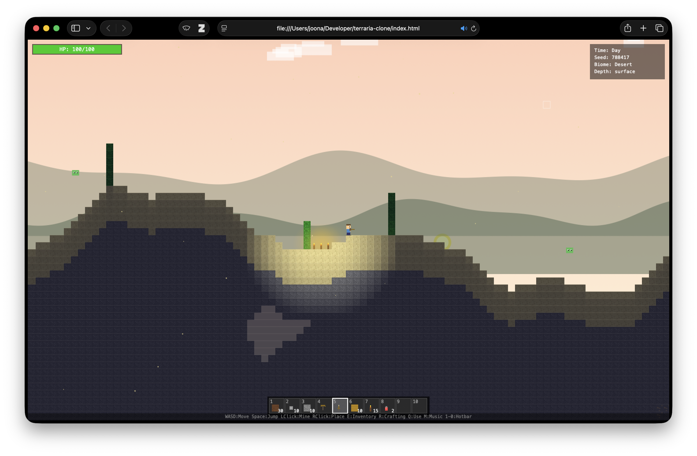

# Terraria Clone

A single-file 2D sandbox game inspired by Terraria.

[](https://github.com/joonanykanen/terraria-clone/actions/workflows/deploy.yml)

## Play

- **Online:** [https://joonanykanen.github.io/terraria-clone/](https://joonanykanen.github.io/terraria-clone/)
- **Local:** Download [`index.html`](index.html) and open it in any modern browser.



**Controls:** WASD/Arrows to move, Space to jump, Left-click to mine/attack, Right-click to place blocks. E for inventory, R for crafting, Q to use items, 1-0 for hotbar, M to toggle music.

**Features:** Procedural world with 3 biomes, caves, ores, trees, day/night cycle, lighting, enemies (slimes, zombies, bats, King Slime boss), 40-slot inventory, 25+ crafting recipes, procedural chiptune music, and pixel-art rendering.

Built by [Qwen3.6-27B](https://huggingface.co/Qwen/Qwen3.6-27B-FP8) in the [pi](https://pi.dev) agent harness.

---

### Prompt

```
Create a Terraria clone in a single HTML file using Canvas and pure JavaScript (no external libraries). The game should include: World & Generation: 2D procedural world generated with Perlin noise (400x200 tiles) Biomes: Forest, Desert, and Snow Tundra, determined by noise Terrain with undulating surface, procedurally generated caves Bedrock layer at the bottom Auto-generated trees (leaves + trunk) based on biome Ores: Iron, Gold, and Diamond distributed by depth Player: Movement with WASD/arrows, jump with Space/W Health system (100 HP) with passive regeneration Fall damage if distance exceeds a threshold Death with automatic respawn (drop inventory on death) Sprite drawn with Canvas (pixel art, no external images) Block & Tile System (16x16 pixels): Procedural textures generated in Canvas for: Dirt, Stone, Grass, Sand, Wood, Leaves, Iron Ore, Gold Ore, Diamond Ore, Snow, Torch, Plank, Workbench, Bedrock Solid/non-solid tiles with hardness for mining Mining mechanic (left click) with visual progress bar Block placement mechanic (right click) Inventory & Crafting: 40-slot inventory with 10-slot hotbar (selectable with 1-0 keys and mouse wheel) Inventory UI with drag-and-drop, sort button Armor slots (head, chest, legs) Scrollable recipe list, crafting with R key or click Items & Recipes: Tools: Wood/Iron/Gold/Diamond Pickaxe (with power and speed stats) Swords: Wood/Iron/Gold/Diamond (with damage stats) Armor: Iron/Gold/Diamond (Helm, Plate, Legs with defense) Metal bars (Iron Bar, Gold Bar, Diamond) as intermediate materials Healing potions (normal and greater) Slime Crown to summon the boss Gel as a slime drop Crafting recipes for everything (e.g., 12 wood + 6 plank = Wood Pickaxe) Enemies: Slimes (jump around, spawn day and night, drop Gel) Zombies (spawn at night, deal more damage) Bats (spawn at night, fly toward the player) King Slime (boss summoned with Slime Crown, 500 HP, drops gold and spawns small slimes on death) Max 12 entities simultaneously, random off-screen spawning Knockback when hitting the player Day/Night & Environment: Day/night cycle with sky color transition Animated sun and moon Twinkling stars at night Moving clouds Snow particles in Snow biome, sand particles in Desert biome 3-layer parallax mountain backgrounds Lighting: Sunlight that gets blocked underground Torches with radial illumination (10-tile radius with falloff) Darkness overlay with variable transparency Audio (all procedural with Web Audio API, no audio files): Procedural BGM that changes based on biome and time (forest_day, forest_night, desert_day, desert_night, snow_day, snow_night, underground, cavern) Each pattern with different root note, tempo, scale, melody, and bass Sound effects: mining, placing, hitting, pickup, hurt, death, crafting, jumping, splat, item use M key to toggle music UI: Health bar with visual percentage and text Defense indicator Hotbar at the bottom with numbers and selection highlight Inventory panel with grid, armor section, and crafting recipe list Top-right info panel: Day/Night, current Seed, current Biome, Depth zone Floating centered notifications Death screen with respawn countdown Tile highlight cursor Controls displayed at the bottom Technical: Game loop with fixed timestep (60 FPS) Tile-based collision for player and entities Camera with smooth player tracking Everything in a single self-contained HTML file Pixel art with image-rendering: pixelated Crosshair cursor.
```
